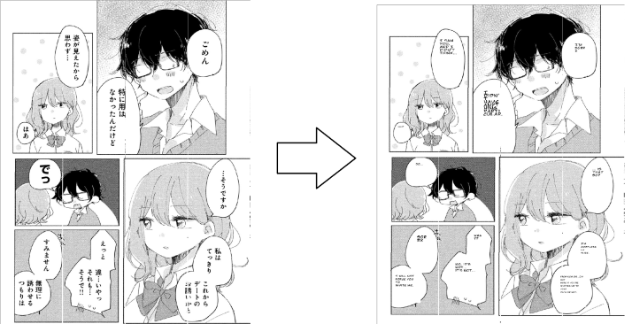

<div align="center">

<a href="https://github.com/FoundedNahte/mangatra"></a>

</div>

## About

Mangatra is a CLI tool that aims to provide the ability to rapidly translate manga.

It can function as a tool for translators as well as an end-to-end solution for hands-off translation.
 - Extract/Replace modes allow translators to extract text into JSONs for translation and replace text boxes with translated JSONs.
 - Translation mode is the combination of extract and replace mode as well as translation from ct2sugoi to provide end-to-end translation. 

It uses YOLOv5 to identify text boxes, OpenCV for image manipuation, and libtesseract for OCR capabilities. Because of the use of YOLOv5 for text box detection, the application can also be generalized to other forms of text besides manga.

## Demo
<div align="center>

<a ></a>

</div>

## Usage
```
Usage: mangatra.exe [OPTIONS] --input <INPUT> --model <MODEL>

Options:
      --extract            Pass '-e' or '--extract' to extract text from images.
      --replace            Pass '-r' or '--replace' to replace text regions in input images from a JSON containing translated text
  -t, --text <TEXT>        If using in "replace" mode, a path to a translated text json must be specified
  -i, --input <INPUT>      Input Path - Directory of JPGs or a single JPG
  -o, --output <OUTPUT>    Optional Output Path - Specify output location for text or image outputs. If not specified, application will revert to the current directory.
  -m, --model <MODEL>      Model Path - A path to a detection model must be specified (ONNX format).
  -p, --padding <PADDING>  Specify size of padding for text regions (Tinkering may improve OCR)
      --single             Use single-threading when processing a folder
  -h, --help               Print help information
  -V, --version            Print version information
```
## Installation

## Roadmap
- [ ] Configuration Files
- [ ] Better Replacement
- [ ] Modular Translation with Python scripts
- [ ] GUI
